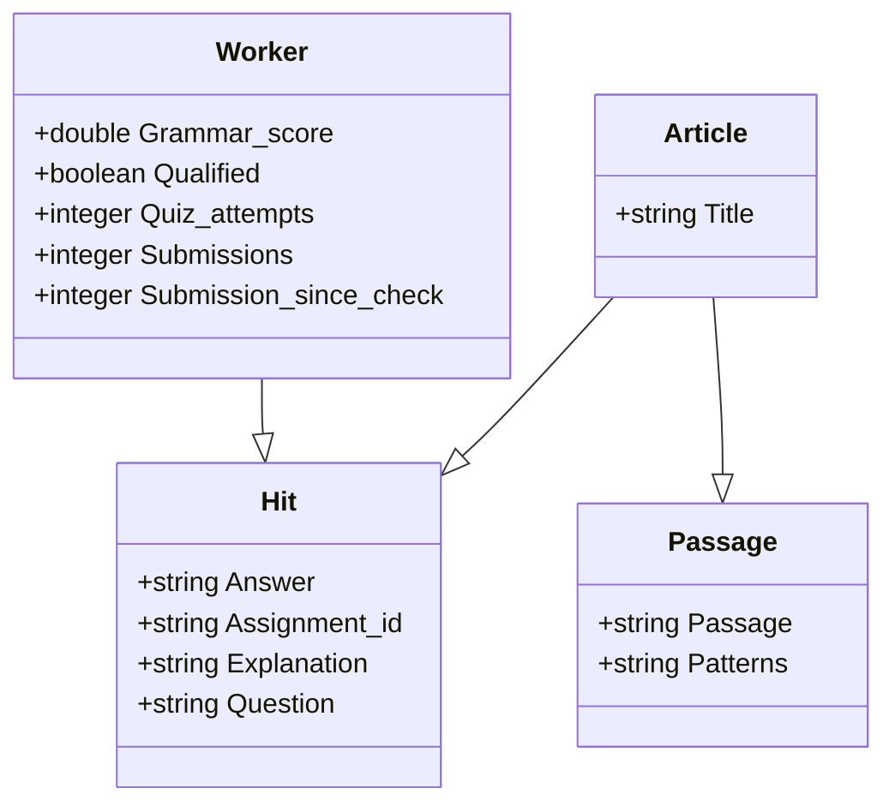

# 🐥 CausalQAPI2
This is the second version of our API to track our MTurk data collection pipeline. The original API interfaced with a Redis Cloud instance as its primary database; however, Redis was insufficient for us because it lacked many SQL features, such as foreign keys. The API is currently hosted with the base URL being `https://the.mturk.monster:50000`. 

## 💻 The Tech
This API was created using Ruby on Rails connected to a PostgreSQL database. 

## 🛠 Setup
CausalQAPI2 runs on Ruby 3.0.0. To setup the API for local development you will need to install its dependencies. To do so, run the command:
```
bundle install
```

Afterwords, you must configure the Redis integration by configuring the following environment variables:
```
export POSTGRESQL_USERNAME=YOUR_USERNAME
export POSTGRESQL_PASSWORD=YOUR_PASSWORD
```

## ERD


CausalQAPI2 Diagram



## 📍 Endpoints
- **GET** `/`
  - Landing page test
- **GET** `/api/get_hits/:worker_id`
  - Returns all hits from given `worker_id`
- **POST** `/api/add_hit`
  - Creates a new hit, using the specified hit
- **GET** `get_top_k/:num_workers/:criteria`
  - Returns the top `num_workers` workers based on the specified `criteria`
- **GET** `/api/worker_qualification/:worker_id`
  - Returns the given `worker_id`'s qualification
- **POST** `/api/reset_last_check/:worker_id`
  - Resets the number of hits submitted since last check for the given `worker_id`
- **POST** `/qualify_worker/:worker_id`
  - Qualifies the given `worker_id`
- **GET** `/api/get_passage`
  - Returns a random passage and deletes it from the database
- **POST** `/api/add_passage`
  - Adds a new passage to the database

## 💡 Feature Requests
If more features are needed, please open an issue on this repository. 
